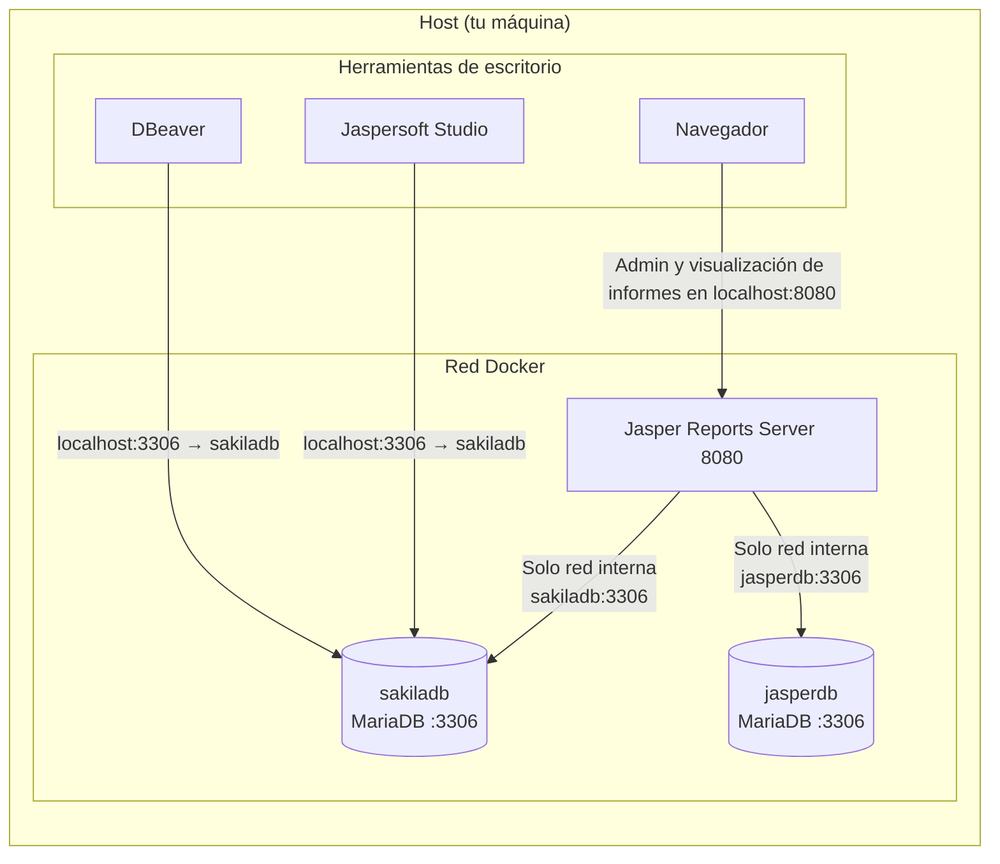

import {
	Aside,
	Card,
	CardGrid,
	LinkCard,
	Steps,
	TabItem,
	Tabs,
} from "@astrojs/starlight/components";

Para el desarrollo de informes en el módulo de Desarrollo de Interfaces, utilizaremos **JasperReports Server (JRS)**. En lugar de una instalación local compleja, emplearemos **Docker Compose** para orquestar un stack completo que incluye el servidor de informes y las bases de datos necesarias para pruebas.

<CardGrid stagger>
	<Card title="JasperReports Server" icon="setting">
		Servidor de informes empresariales basado en Bitnami. Expone una interfaz web para gestionar repositorios, fuentes de datos y ejecución de informes.
	</Card>
	<Card title="Infraestructura MariaDB" icon="random">
		Doble instancia de base de datos: una para la persistencia interna de JRS (`jasperdb`) y otra de ejemplo (`sakiladb`) para nuestras prácticas.
	</Card>
	<Card title="Docker Compose" icon="rocket">
		Despliegue reproducible y aislado de todo el entorno con un único comando, evitando conflictos de puertos o dependencias locales.
	</Card>
</CardGrid>
## Arquitectura del Stack

El entorno se compone de tres servicios principales que interactúan entre sí dentro de una red aislada de Docker:

1.  **`jrs`**: El motor de JasperReports. Accesible por los puertos `8080` (HTTP) y `8443` (HTTPS).
2.  **`jasperdb`**: Instancia de MariaDB que almacena la configuración de usuarios, roles y el repositorio de informes del servidor.
3.  **`sakiladb`**: Base de datos MariaDB cargada con el esquema *Sakila* (una base de datos de ejemplo sobre alquiler de películas) para realizar consultas y generar informes reales.



Los contenedores se resuelven entre sí **por nombre de servicio** dentro de la red (`jrs`, `jasperdb`, `sakiladb`). Solo los puertos **mapeados al host** (`ports:` en `docker-compose`) son accesibles desde fuera de esa red; el tráfico entre `jrs` y las bases de datos no sale al host.

## Instalación y Puesta en Marcha

Sigue estos pasos para desplegar el entorno en tu máquina local.

<Steps>
1.  **Clonar el repositorio de configuración:**
    Descarga el stack preparado con el archivo `docker-compose.yml`.
    ```bash
    git clone https://github.com/gach24/DID.git
    cd DID/12-project-07
    ```

2.  **Configurar variables de entorno:**
    Crea un archivo `.env` basado en el ejemplo para definir las credenciales y nombres de base de datos.
    ```bash
    # Configuración de MariaDB
    MARIADB_USER=jasperreports
    MARIADB_PASSWORD=jasperreports
    MARIADB_DATABASE=jasperreportsdb
    ALLOW_EMPTY_PASSWORD=yes

    # Configuración de JasperReports Server
    JASPERREPORTS_USERNAME=admin
    JASPERREPORTS_PASSWORD=admin
    ```

3.  **Lanzar los contenedores:**
    Ejecuta el comando de Docker Compose en segundo plano. La primera ejecución descargará las imágenes e inicializará las bases de datos (puede tardar unos minutos).
    ```bash
    docker compose up -d
    ```

4.  **Verificar el estado:**
    Asegúrate de que los tres contenedores están en estado `Up`.
    ```bash
    docker compose ps
    ```

</Steps>

<Aside type="caution" title="Recursos del sistema">
	JasperReports Server es una aplicación Java que requiere recursos considerables. Asegúrate de tener al menos **2GB de RAM** disponibles para que el contenedor `jrs` funcione correctamente.
</Aside>

## Acceso y Configuración

Una vez que los servicios estén en marcha, puedes acceder a la consola de administración:

- **URL**: [http://localhost:8080/jasperserver/](http://localhost:8080/jasperserver/)
- **Usuario**: `admin`
- **Contraseña**: `admin` (o la definida en tu `.env`)

### Habilitar CORS para integración con React

Para que nuestra aplicación de **React** pueda consumir informes directamente desde el servidor JRS, debemos habilitar CORS en el Tomcat interno de Jasper. El repositorio incluye un archivo `web.xml` preconfigurado.

```bash
# Copia la configuración de CORS al contenedor en ejecución
docker cp ./web.xml 12-project-07-jrs-1:/opt/bitnami/tomcat/webapps/jasperserver/WEB-INF/web.xml
```

<Aside type="tip" title="Persistencia de datos">
	Los datos se mantienen en volúmenes de Docker (`jasperdb_data`, `jrs_data`, `sakiladb_data`). Si quieres resetear el entorno completamente, usa el script `./clean.sh` incluido en el repo, pero ten en cuenta que perderás todos los informes creados.
</Aside>

## Aplicación en el proyecto

En este módulo, el entorno de JasperReports nos servirá para:

- **Diseñar informes**: Conectaremos **Jaspersoft Studio** a la instancia `sakiladb` para diseñar plantillas `.jrxml`.
- **Publicar en el servidor**: Subiremos los informes al repositorio de `jrs`.
- **Consumo desde el Frontend**: Integraremos las visualizaciones de informes en nuestra aplicación de escritorio o web mediante llamadas a la API REST de Jasper o visualización directa.

## Resumen rápido

| Servicio | Puerto | Propósito |
| :--- | :--- | :--- |
| **JRS** | `8080` | Servidor web y motor de informes |
| **JasperDB** | `3306` (int) | Configuración interna de JRS |
| **SakilaDB** | `3306` (ext) | Datos de ejemplo para las prácticas |

## Siguientes pasos

Una vez desplegado el entorno, continuaremos con la conexión de orígenes de datos y el diseño del primer informe:

<CardGrid>
	<LinkCard
		href="https://community.jaspersoft.com/documentation/jasperreports-server-administration-guide/v80/introduction-jasperreports-server"
		title="Documentación de JRS"
		description="Guía oficial de administración de JasperReports Server."
		target="_blank"
	/>
	<LinkCard
		href="https://github.com/gach24/DID/tree/main/12-project-07"
		title="Repositorio del Stack"
		description="Accede al código fuente del despliegue Docker."
		target="_blank"
	/>
</CardGrid>
